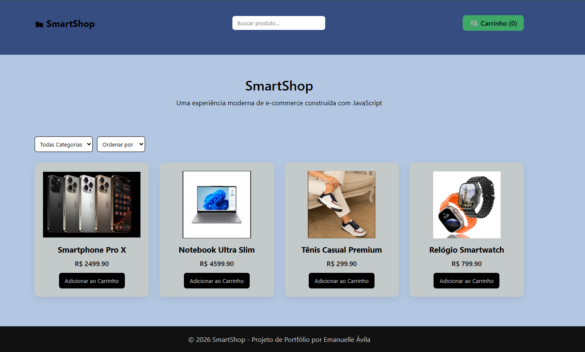

# 🛍 SmartShop

Projeto de e-commerce desenvolvido com **HTML, CSS e JavaScript puro**, simulando funcionalidades básicas de uma loja online.

🔗 Demo online
https://manu21avila.github.io/smartshop-ecommerce/

---

## 🚀 Funcionalidades

- Listagem dinâmica de produtos
- Carrinho de compras com LocalStorage
- Busca de produtos
- Filtros por categoria
- Ordenação por preço
- Cupom de desconto
- Dark Mode
- Toast de confirmação
- Modal de produto
- Carrinho lateral estilo Amazon

---

## 🧰 Tecnologias utilizadas

- HTML5
- CSS3
- JavaScript
- LocalStorage
- Git / GitHub

---

## 📸 Preview

---

## 🎯 Objetivo do projeto

Este projeto foi desenvolvido para demonstrar habilidades em:

- Manipulação de DOM
- Estruturação de aplicações front-end
- Interface de e-commerce
- Boas práticas de organização de código

---

## 👩‍💻 Autora

Emanuelle Ávila
